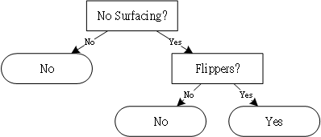

# Decision Tree
|&nbsp; |Can survive without coming surface?|Has flippers?|Fish?|
|:
|1|Yes                                |Yes          |Yes  |
|2|Yes                                |Yes          |Yes  |
|3|Yes                                |No           |No   |
|4|No                                 |Yes          |No   |
|5|No                                 |Yes          |No   |

```prolog
?- consult(training_set).
?- consult(dt).
```

## Create Decision Tree

```prolog
?- training_set(DataSet), create_tree(DataSet, Tree).
DataSet = [example(fish, ['no surfacing'=1, flippers=1]), example(fish, ['no surfacing'=1, flippers=1]), example(not_fish, ['no surfacing'=1, flippers=0]), example(not_fish, ['no surfacing'=0, flippers=1]), example(not_fish, ['no surfacing'=0, flippers=1])],
Tree = ('no surfacing'->[1: (flippers->[1:fish, 0:not_fish]), 0:not_fish]).
```



## Classify

```prolog
?- classify(('no surfacing'->[1: (flippers->[1:fish, 0:not_fish]), 0:not_fish]), ['no surfacing' = 1, 'flippers' = 0], Type).
Type = not_fish.
?- classify(('no surfacing'->[1: (flippers->[1:fish, 0:not_fish]), 0:not_fish]), ['no surfacing' = 1, 'flippers' = 1], Type).
Type = fish.
```


